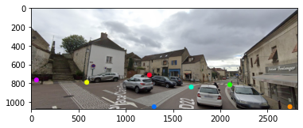
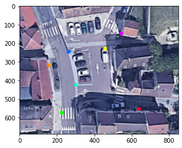
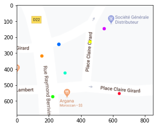

```python
#!apt update
```

    Hit:1 http://deb.debian.org/debian buster InRelease
    Hit:2 http://security.debian.org/debian-security buster/updates InRelease
    Hit:3 http://deb.debian.org/debian buster-updates InRelease
    Reading package lists... Done
    Building dependency tree       
    Reading state information... Done
    85 packages can be upgraded. Run 'apt list --upgradable' to see them.


```python
#!apt install libgl1-mesa-glx -y
```

    Reading package lists... Done
    Building dependency tree       
    Reading state information... Done
    libgl1-mesa-glx is already the newest version (18.3.6-2+deb10u1).
    0 upgraded, 0 newly installed, 0 to remove and 85 not upgraded.


```python
#!pip install opencv-python
```

    Requirement already satisfied: opencv-python in /usr/local/lib/python3.8/site-packages (4.5.1.48)
    Requirement already satisfied: numpy>=1.17.3 in /usr/local/lib/python3.8/site-packages (from opencv-python) (1.19.5)
    WARNING: You are using pip version 20.0.2; however, version 21.0.1 is available.
    You should consider upgrading via the '/usr/local/bin/python -m pip install --upgrade pip' command.


```python
from dataclasses import dataclass
from typing import List
import numpy
import matplotlib.pyplot as plt
import matplotlib.image
import cv2
```


```python
@dataclass
class Point:
    x: int
    y: int
    tag: str = None
```


```python
@dataclass
class Mapping:
    source_points: List[Point]
    target_points: List[Point]
    street_view_file: str = None
    satellite_view_file: str = None
    map_view_file: str = None
        
    def get_array(self):
        source_array = numpy.array([[p.x, p.y] for p in self.source_points])
        target_array = numpy.array([[p.x, p.y] for p in self.target_points])
        return source_array, target_array
        
    def display(self):
        try:
            for image_file in [self.street_view_file, self.satellite_view_file, self.map_view_file]:
                if not image_file:
                    continue
                img = matplotlib.image.imread(image_file)
                plt.imshow(img)
                plt.show()
        except:
            raise Exception(f"Image not find: {self.image_file}.")
```


```python
class Homography:
    
    def __init__(self):
        self.matrix = None
        
    def fit(self, mapping):
        source_array, target_array = mapping.get_array()
        self.matrix, status = cv2.findHomography(source_array, target_array)
        
    def transform(self, point):
        source_point = numpy.array([[point.x, point.y]], dtype='float32')
        source_point = numpy.array([source_point])
        target_point = cv2.perspectiveTransform(source_point, self.matrix)
        return Point(target_point[0][0][0], target_point[0][0][1])
```


```python
source_points = [
    Point(56, 766, "pink"),
    Point(591, 790, "yellow"),
    Point(1251, 712, "red"),
    Point(1303, 1055, "blue"),
    Point(1695, 842, "teal"),
    Point(2104, 817, "green"),
    Point(2738, 1051, "orange")
]
```


```python
target_points = [
    Point(540, 151, "pink"),
    Point(458, 231, "yellow"),
    Point(650, 553, "red"),
    Point(262, 246, "blue"),
    Point(301, 425, "teal"),
    Point(224, 574, "green"),
    Point(157, 319, "orange")
]
```


```python
mapping = Mapping(source_points, 
                  target_points, 
                  "./sample/street_view_tagged.png", 
                  "./sample/satellite_tagged.png", 
                  "./sample/map_tagged.png")
```


```python
mapping.display()
```


    

    


    

    


    

    


```python
h = Homography()
```


```python
h.fit(mapping)
```

Looking at white car bottom on first picture (1800, 900), it translate to (258, 345) on the map. Works pretty well !


```python
h.transform(Point(1800, 900))
```


    Point(x=258.5717, y=345.16177, tag=None)


```python

```
